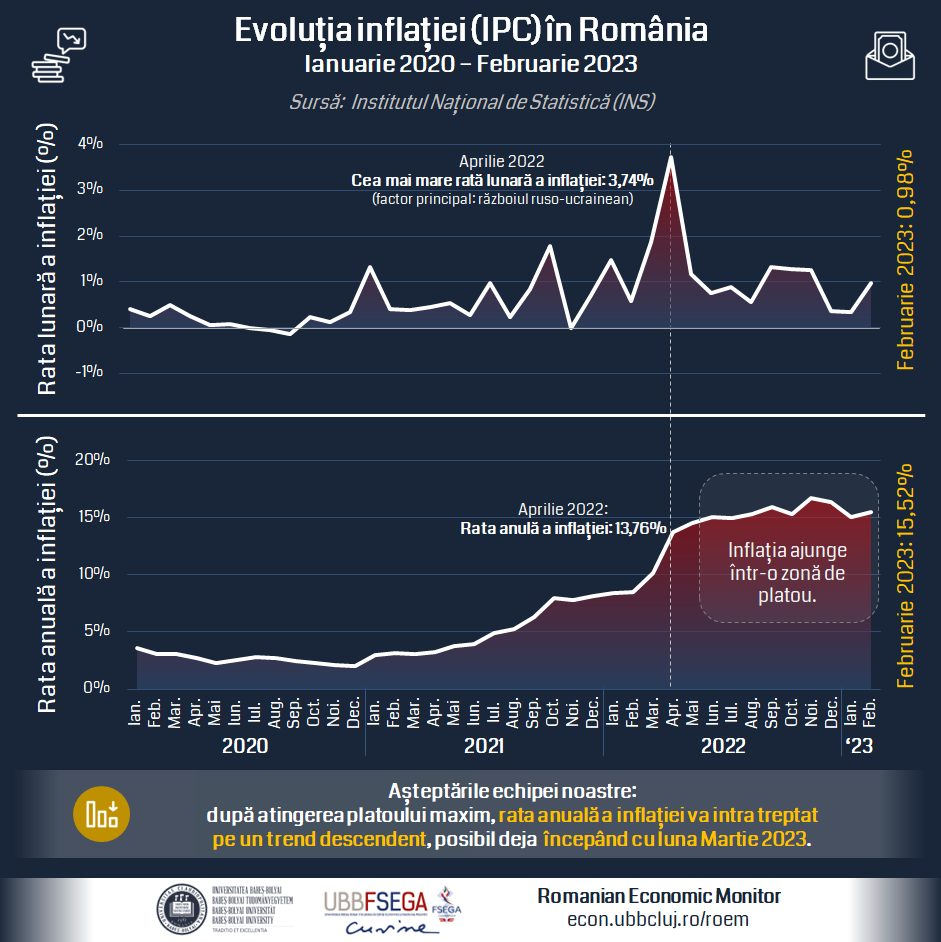

[RO] 💰📉 Economia României, precum și cea a Europei în general, a reușit treptat să găsească modalități de înlocuire a produselor și serviciilor afectate de război, inclusiv cele energetice. 👉 Astfel, presiunile pe piața mărfurilor s-au diminuat, ceea ce a condus la atingerea unui platou, iar luna Martie 2023 ar putea marca intrarea pe un trend descendent a ratei anuale a inflației.

[HU] 💰📉 A romániai, valamint az európai gazdaság fokozatosan kezdi megtalálni a háború által érintett termékek és szolgáltatások helyettesítésének a módját, beleértve az energetikai piacot is. 👉 Ezáltal az árupiacokra nehezedő nyomás csökkent, ami az infláció tetőzését eredményezte az elmúlt időszakban, március hónap pedig az éves inflációs ráta csökkentő trendjének kezdetét is elhozhatja.

[EN] 💰📉 The Romanian, but also the whole European economy, has gradually found alternatives to replace goods and services affected by the war, including energy products. 👉 Thus, pressures on product markets have eased, leading to a plateau in the evolution of inflation, while March 2023 could mark the beginning of a downward trend in the annual rate of inflation. Kevesebb jelenjen meg

<!--  -->
